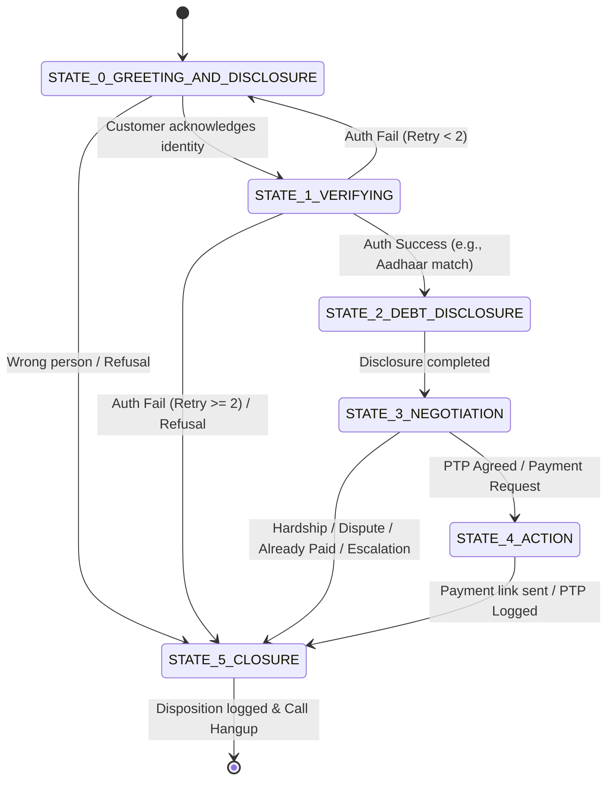

# High-Level Design (HLD): Kapture Finance Collections Voicebot ("Maya")

This document details the high-level system architecture, conversational states, intent classification, API specifications, compliance frameworks, and observability for **Maya**, the outbound voice collection agent designed for **Kapture Finance**. 

---

## 1. System Architecture & Latency Budget

### 1.1 Voice AI Pipeline Architecture
Maya is built using a modern, low-latency Voice AI pipeline orchestrated via **Vapi.ai**. The flow of voice data and orchestration is structured as follows:

```mermaid
graph TD
    %% Telephony layer
    Tel[Customer Phone / PSTN] <-->|SIP Trunking / WebRTC| Vapi[Vapi.ai Orchestrator]

    %% Pipeline hops
    Vapi <-->|Audio Stream (PCM 8kHz)| STT[Deepgram STT]
    Vapi <-->|Text Output / API Triggers| LLM[LLM Orchestrator: GPT-4o-mini]
    Vapi <-->|Text Stream| TTS[Cartesia TTS]

    %% External APIs and Datastore
    LLM <-->|Tool Call JSON| Webhook[FastAPI Webhook Gateway]
    Webhook <-->|Database Queries| DB[(Kapture CRM / Datastore)]
    Webhook -->|API Notification| SMS[SMS/WhatsApp Gateway]
```

### 1.2 Latency Budgets (per Hop)
To ensure a human-like response cadence, the **turn-taking latency (time from customer stop-speaking to bot start-speaking)** must be kept **under 1.2 seconds**. 

| Pipeline Hop | Technology | Expected Latency | Budget Limit | Mitigation Strategy |
| :--- | :--- | :--- | :--- | :--- |
| **STT (Speech-to-Text)** | Deepgram Nova-2 | 120 ms | 150 ms | Streaming connection, endpointing optimization. |
| **LLM (Orchestrator)** | GPT-4o-mini | 280 ms (TTFT) | 400 ms | Use small context size; enforce brief, concise system outputs. |
| **TTS (Text-to-Speech)** | Cartesia Multilingual | 100 ms (TTFT) | 150 ms | Stream chunked text to speech immediately as LLM responds. |
| **Network & Telephony** | SIP/WebRTC (Vapi) | 150 ms | 200 ms | Regional deployment of edge nodes (e.g., AWS AP-South-1). |
| **Webhook / Database** | FastAPI + Postgres | 80 ms | 150 ms | Optimized indexing, non-blocking asynchronous APIs. |
| **Total Roundtrip** | **End-to-End** | **~650 ms** | **1,200 ms** | **Comfortably under the conversational threshold.** |

---

## 2. State Machine & Conversation Flow

The bot enforces a strict state machine where the customer’s progression is locked by state. **Under no circumstances will debt details or loan specifics be disclosed prior to successful verification.**



### 2.1 State Definitions and Transition Logic

1. **`STATE_0_GREETING_AND_DISCLOSURE` (Greeting & Company/Purpose Disclosure)**
   - **Bot action**: Identifies self as Maya from Kapture Finance, states the call is regarding a personal loan account, and asks if they are speaking to **Rahul Sharma**.
   - **Transition**:
     - *If "Yes/Speaking"*: Transition to `STATE_1_VERIFYING`.
     - *If "No/Wrong Person"*: Move to `STATE_5_CLOSURE` (Disposition: `WRONG_NUMBER`).
     - *If "What is this about?" / "Tell me first"*: Explain that it is about an outstanding account, but due to privacy regulations, verification is required first. Stay in `STATE_0` or move to `STATE_1`.

2. **`STATE_1_VERIFYING` (Enforced Identity Authentication)**
   - **Bot action**: Asks for verification: "To proceed, could you please confirm the last 4 digits of your Aadhaar card?"
   - **Transition**:
     - *If matches database (via `verify_customer` tool)*: Transition to `STATE_2_DEBT_DISCLOSURE`.
     - *If does not match (Attempt 1)*: Prompt again. Stay in `STATE_1`.
     - *If fails twice / Refuses*: Transition to `STATE_5_CLOSURE` (Disposition: `VERIFICATION_FAILED`).

3. **`STATE_2_DEBT_DISCLOSURE` (Mini-Miranda & Debt Disclosure)**
   - **Bot action**: Disclose debt details compliantly: "Thank you, Rahul. This call is to inform you that your personal loan EMI of ₹8,499 is overdue by 12 days. This is an attempt to collect a debt."
   - **Transition**: Immediately transition to `STATE_3_NEGOTIATION`.

4. **`STATE_3_NEGOTIATION` (Payment Resolution and Objection Handling)**
   - **Bot action**: Asks: "Can we secure a commitment to clear this outstanding balance today?"
   - **Transitions**:
     - *If "Yes / Can pay today"*: Transition to `STATE_4_ACTION` (`send_payment_link`).
     - *If "Can pay on a future date" (PTP)*: Verify date is within 3 days. Transition to `STATE_4_ACTION` (`log_promise_to_pay`).
     - *If "Already Paid"*: Ask for transaction reference/date. Transition to `STATE_5_CLOSURE` (Disposition: `ALREADY_PAID`).
     - *If "Cannot Pay" (Financial hardship)*: Identify duration of hardship. Transition to `STATE_5_CLOSURE` (Disposition: `HARDSHIP_ESCALATION` or `AGENT_ROUTING`).
     - *If "Dispute / Not my loan"*: Collect details. Transition to `STATE_5_CLOSURE` (Disposition: `DISPUTED`).

5. **`STATE_4_ACTION` (Execution)**
   - **Bot action**: Invokes backend tool to send payment links or log promises.
   - **Transition**: Move to `STATE_5_CLOSURE`.

6. **`STATE_5_CLOSURE` (Call Conclusion & Disposition)**
   - **Bot action**: Summarizes call outcome, invokes `mark_disposition` to log call status, thanks user, and hangs up (or transfers to human).

---

## 3. Intents & Entities

The NLU engine (GPT-4o-mini) extracts structured intents and entities to determine the state transitions.

### 3.1 Intents
- **`affirmative`**: Confirming identity, agreeing to verify, agreeing to pay.
- **`negative`**: Denying identity, refusing to verify, refusing to pay.
- **`will_pay_now`**: Customer expresses intent to pay immediately.
- **`will_pay_later` (PTP)**: Customer commits to pay on a future date.
- **`already_paid`**: Customer claims payment is already made.
- **`cannot_pay_hardship`**: Customer states financial inability (job loss, medical emergency).
- **`dispute`**: Customer disputes the loan, amount, or existence of the debt.
- **`wrong_person`**: Person answering states they are not the debtor.
- **`request_callback`**: Customer asks to be called back later.
- **`opt_out_dnc`**: Customer requests to be placed on the Do Not Call (DNC) list.
- **`hostile`**: Customer is abusive, shouting, or uses profanity.

### 3.2 Extracted Entities
- **`ptp_date`**: Date of promised payment (ISO 8601 string or relative date e.g., "this Friday").
- **`verification_digits`**: 4-digit string representing Aadhaar/PAN digits.
- **`payment_method`**: Desired channel (e.g., UPI, NetBanking, Debit Card).
- **`already_paid_details`**: Date of payment and/or transaction reference ID.
- **`callback_time`**: Requested time/date for a callback.

---

## 4. Tools & Webhook APIs

The voicebot uses Vapi tool calling to interact with Kapture CRM databases. All parameters are strictly typed.

### 4.1 `verify_customer`
Verifies if the customer provided Aadhaar/PAN digits match database.
- **Input JSON**:
  ```json
  {
    "customer_id": "CUST_9988",
    "verification_type": "aadhaar_last_4",
    "verification_value": "1234"
  }
  ```
- **Output JSON**:
  ```json
  {
    "status": "VERIFIED",
    "message": "Customer identity authenticated successfully.",
    "customer_name": "Rahul Sharma"
  }
  ```

### 4.2 `log_promise_to_pay`
Saves a committed promise date in the loan records.
- **Input JSON**:
  ```json
  {
    "customer_id": "CUST_9988",
    "ptp_date": "2026-08-20",
    "ptp_amount": 8499.00
  }
  ```
- **Output JSON**:
  ```json
  {
    "status": "SUCCESS",
    "ptp_id": "PTP_554433",
    "message": "Promise to pay logged for 2026-08-20."
  }
  ```

### 4.3 `send_payment_link`
Triggers an SMS/WhatsApp containing the UPI/Netbanking payment portal link.
- **Input JSON**:
  ```json
  {
    "customer_id": "CUST_9988",
    "amount": 8499.00,
    "channel": "SMS"
  }
  ```
- **Output JSON**:
  ```json
  {
    "status": "SENT",
    "message": "Payment link sent to registered mobile number +91 XXXXX XX123."
  }
  ```

### 4.4 `mark_disposition`
Logs the final result of the call in CRM to determine retry logic.
- **Input JSON**:
  ```json
  {
    "customer_id": "CUST_9988",
    "disposition": "PTP_COLLECTED",
    "notes": "Customer agreed to pay by 20th August. Payment link sent."
  }
  ```
- **Output JSON**:
  ```json
  {
    "status": "LOGGED"
  }
  ```

---

## 5. Compliance, Guardrails & Edge Cases

### 5.1 Fair-Collection Compliance (RBI & FDCPA Norms)
1. **Mandatory Self-Disclosure**: The bot must declare identity ("Maya"), company ("Kapture Finance"), and purpose ("Personal loan account update") within the first two sentences.
2. **Third-Party Disclosure Prohibition**: If a spouse, child, or colleague answers, the bot **must not** disclose the loan amount or debt status. The bot will request a callback or ask for the primary borrower without explaining why.
3. **Permitted Hours (Time-of-Day Routing)**: Call placing triggers must only operate between **8:00 AM and 7:00 PM** local customer time.
4. **Tone & Manner**: The system prompt strictly prohibits aggressive, threatening, or repetitive badgering phrases. The tone is maintained as "Firm, professional, empathetic, and polite."

### 5.2 Conversational Edge Cases

| Edge Case | Detection | Bot Behavior | Transition |
| :--- | :--- | :--- | :--- |
| **Wrong Number** | "I am not Rahul" / "Wrong number" | "My apologies. I will update our records to remove this number." | Mark `WRONG_NUMBER` -> Hang up. |
| **DNC Request** | "Stop calling" / "DNC" | "I understand. I will mark your number to prevent future collections calls. Have a good day." | Mark `DNC_REQUEST` -> Hang up. |
| **Already Paid** | "I already paid yesterday" | "Thank you. Let me check. Could you share the transaction ID or the date of payment?" | Mark `ALREADY_PAID` -> Request review. |
| **Dispute Amount** | "This amount is wrong" | "I apologize for the discrepancy. I will pause collections on this and escalate this to our support team." | Mark `DISPUTED` -> Agent escalation. |
| **Voicemail/No Input** | Silence > 5s | "Hello? I am unable to hear you. I will try calling back later." (Attempts max 2 times). | Mark `NO_RESPONSE` -> Hang up. |
| **Hostile Caller** | Profanity / Shouting | "I understand your frustration, but I must ask you to maintain a professional tone, otherwise I will have to end this call." | Terminate if ongoing -> Mark `ABUSIVE`. |
| **Bilingual Switch** | "Hindi mein baat karo" | Switches response generation to Hindi (e.g., "जी, मैं आपकी सहायता हिंदी में करूँगी..."). | Maintain current state in Hindi. |

---

## 6. Observability, Metrics & Testing

To maintain pipeline health and conversation effectiveness, we track four core metrics:

```mermaid
gantt
    title Collection Bot KPI Dashboard
    dateFormat  X
    axisFormat %s
    section Efficiency
    Containment Rate (Target >70%) :active, 0, 70
    Promise to Pay (PTP) Rate (Target >35%) : 0, 35
    section Performance
    E2E Latency (Target <1.2s) :crit, active, 0, 80
    Drop/Abandonment Rate (Target <5%) : 0, 5
```



### 6.1 Core Observability Metrics
1. **Containment Rate**: Percentage of calls resolved (PTP collected, wrong number identified, DNC logged, or already paid checked) without needing human agent transfer.
2. **PTP (Promise to Pay) Rate**: Percentage of verified borrowers who make a valid payment commitment (today or future date).
3. **End-to-End Latency**: The p50, p90, and p99 of the voice pipeline turn-around. Any spike above 1.5 seconds is flagged as a quality issue.
4. **Drop / Abandonment Rate**: Percentage of users who hang up mid-call (specifically analyzing which state they drop in to locate prompt friction).
5. **Aadhaar/PAN Input Failure Rate**: Tracking how many users fail verification to fine-tune STT acoustic models for numerical digit string entry.

### 6.2 Scale Testing Strategy
To roll out Maya safely at scale, we propose a three-tiered testing structure:
- **Unit Tests (CI/CD)**: Verify LLM output parser consistency and JSON schema compliance of tool payloads.
- **Synthesized Voice Audits (Offline)**: Run simulated audio interactions (using LLM-to-LLM voice testers) to stress-test the state transitions and verify that the bot never discloses debt prior to `STATE_2`.
- **Canary Rollout (Production)**: Deploy the bot to 5% of the overdue portfolio (1-5 days past due) and run side-by-side human audits of call recordings before scaling to 100%.
